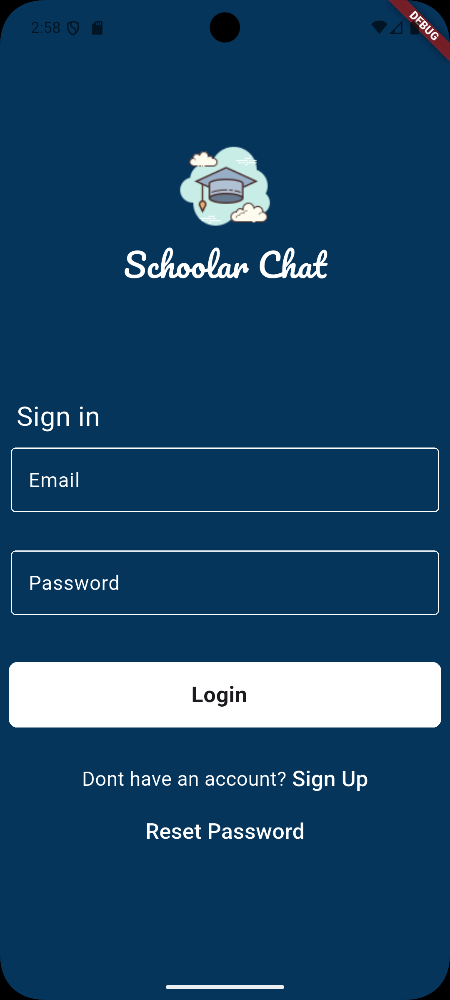
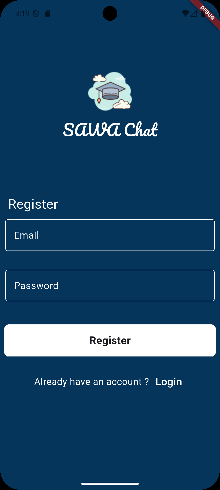
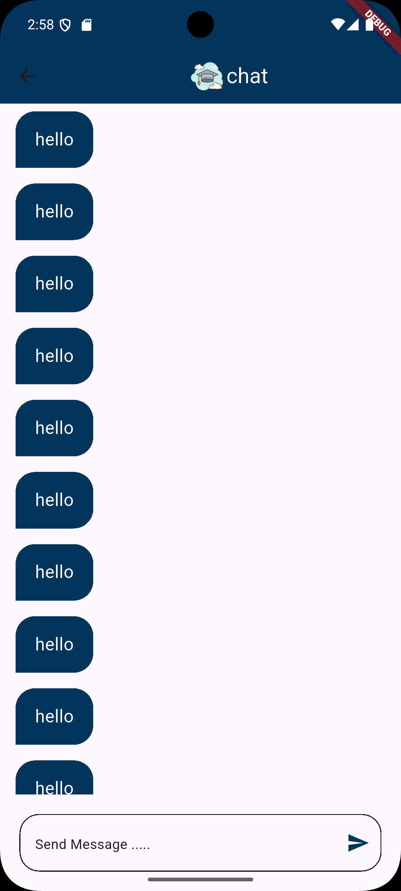
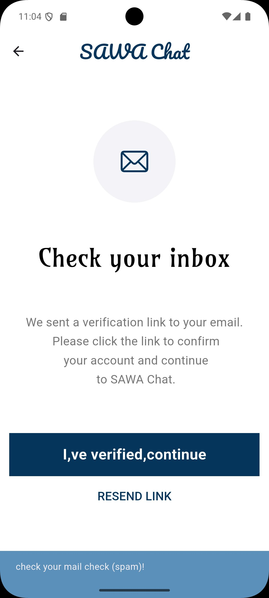
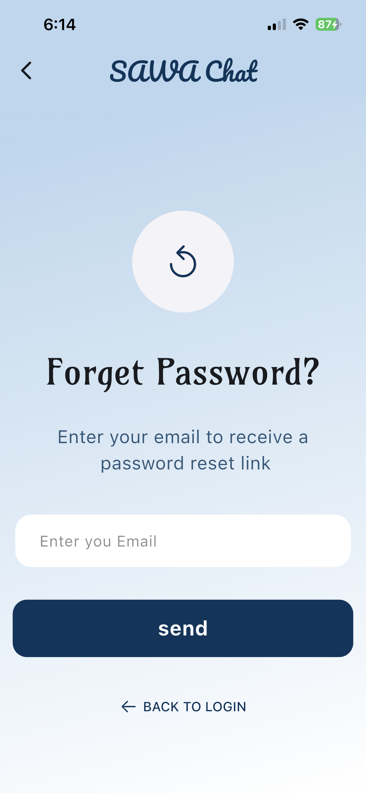

# 💬 Sawa Chat

**Sawa** is a real-time chat application built with **Flutter** and **Firebase**, featuring a full authentication flow with email verification, private messaging between users, and a clean, premium UI.

---

## 📱 Screenshots

| Login | Register | Chat | Verification | Reset Password |
|-------|----------|------|--------------|----------------|
|  |  |  |  |  |

---

## ✨ Features

- 🔐 **Email & Password Authentication** (Firebase Auth)
- ✅ **Email Verification** before accessing the chat
- 🔑 **Reset Password** via email link
- 👤 **Username Registration** with uniqueness validation
- 💬 **Private Real-time Chat** between users via Firestore
- 👥 **Users Screen** to browse and start conversations
- 🔀 **Smooth Screen Transitions** with SharedAxis animations
- ⚡ **Loading indicators** with SpinKit animations
- 📱 **Responsive UI** with flutter_screenutil
- 🎨 **Custom reusable widgets** (Button, TextField, SnackBar)
- 🗨️ **Chat bubbles** — sender (navy) / receiver (light gray)
- 💬 **Empty state** when no messages exist

---

## 🛠️ Tech Stack

| Technology | Usage |
|---|---|
| Flutter | UI Framework |
| Firebase Auth | Authentication |
| Cloud Firestore | Real-time Database & User Storage |
| flutter_spinkit | Loading animations |
| flutter_screenutil | Responsive sizing |
| email_validator | Email format validation |
| animations | Shared axis screen transitions |

---

## 📁 Project Structure

```
lib/
├── main.dart                    # App entry point & routes
├── constant.dart                # Colors, Firestore constants & generateChatId
├── firebase_options.dart        # Firebase config (auto-generated)
├── models/
│   └── message_model.dart       # Message data model
├── custom_widgets/
│   ├── app_router.dart          # Shared axis route transition
│   ├── chat_bubble.dart         # Chat bubble widget
│   ├── custom_button.dart       # Reusable primary button
│   ├── custom_text_button.dart  # Reusable text button
│   ├── custom_text_filed.dart   # Reusable text field
│   └── show_snack_bar.dart      # Global snackbar helper
└── screens/
    ├── login.dart               # Login screen
    ├── register.dart            # Register screen with username
    ├── chat_screen.dart         # Private chat screen
    ├── users.dart               # Users list screen
    ├── verification_screen.dart # Email verification screen
    └── resetPassword.dart       # Reset password screen
```

---

## 🔄 App Flow

```
Login → Users Screen → Select User → Private Chat Room
  ↓
Register → Enter Username + Email + Password → Email Verification → Login
```

---

## 🚀 Getting Started

### Prerequisites

- Flutter SDK `>=3.0.0`
- Dart SDK `>=3.0.0`
- A Firebase project

### Installation

1. **Clone the repository**
   ```bash
   git clone https://github.com/moalaa125/sawa.git
   cd sawa
   ```

2. **Install dependencies**
   ```bash
   flutter pub get
   ```

3. **Setup Firebase**
   - Create a project on [Firebase Console](https://console.firebase.google.com/)
   - Enable **Email/Password** Authentication
   - Enable **Cloud Firestore**
   - Run FlutterFire CLI:
     ```bash
     flutterfire configure
     ```

4. **Run the app**
   ```bash
   flutter run
   ```

---

## 📦 Dependencies

```yaml
dependencies:
  firebase_core: latest
  firebase_auth: latest
  cloud_firestore: latest
  flutter_spinkit: latest
  flutter_screenutil: latest
  email_validator: latest
  animations: latest
```

---

## 🔒 Security Note

> ⚠️ Never commit your `firebase_options.dart` to a public repository.
> Add it to `.gitignore`:
> ```
> lib/firebase_options.dart
> ```

---

## 🐛 TODO

- [ ] Add message timestamps inside chat bubbles
- [ ] Add typing indicator
- [ ] Add user profile & avatar
- [ ] Add image sharing in chat
- [ ] Add friends system with username search
- [ ] Add logout button in users screen

---

## 👨‍💻 Author

**Mohamed Alaa**
- GitHub: [@moalaa125](https://github.com/moalaa125)

---

## 📄 License

This project is licensed under the MIT License.
