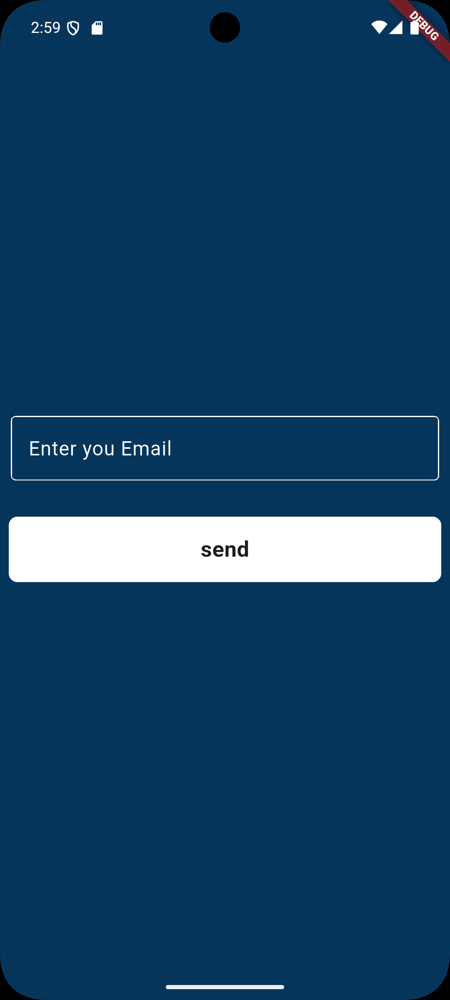

# 💬 Sawa

**Sawa** is a real-time chat application built with **Flutter** and **Firebase**, featuring full authentication flow with email verification.

---

## 📱 Screenshots

| Login | Register | Chat | Reset Password |
|-------|----------|------|----------------|
|  |  |  |  |

---

## ✨ Features

- 🔐 **Email & Password Authentication** (Firebase Auth)
- ✅ **Email Verification** before accessing the chat
- 🔑 **Reset Password** via email link
- 💬 **Real-time Chat UI** with chat bubbles
- ⚡ **Loading indicators** with SpinKit animations
- 🎨 **Custom reusable widgets** (Button, TextField, SnackBar)
- 🦸 **Hero animation** on the logo between screens

---

## 🛠️ Tech Stack

| Technology | Usage |
|---|---|
| Flutter | UI Framework |
| Firebase Auth | Authentication |
| Firebase Firestore | Real-time Database _(coming soon)_ |
| flutter_spinkit | Loading animations |
| email_validator | Email format validation |

---

## 📁 Project Structure

```
lib/
├── main.dart                  # App entry point & routes
├── constant.dart              # Colors & constants
├── custom_text_filed.dart     # Reusable text field
├── custom_widgets/
│   ├── chatBubble.dart        # Chat bubble widget
│   ├── custom_button.dart     # Reusable button
│   ├── custom_text_button.dart
│   └── show_snack_bar.dart    # Global snackbar helper
└── screens/
    ├── login.dart             # Login screen
    ├── register.dart          # Register screen
    ├── chat_screen.dart       # Main chat screen
    ├── verification_screen.dart
    └── resetPassword.dart
```

---

## 🚀 Getting Started

### Prerequisites

- Flutter SDK `>=3.0.0`
- Dart SDK `>=3.0.0`
- A Firebase project

### Installation

1. **Clone the repository**
   ```bash
   git clone https://github.com/moalaa125/sawa.git
   cd sawa
   ```

2. **Install dependencies**
   ```bash
   flutter pub get
   ```

3. **Setup Firebase**
   - Create a project on [Firebase Console](https://console.firebase.google.com/)
   - Enable **Email/Password** Authentication
   - Run FlutterFire CLI:
     ```bash
     flutterfire configure
     ```

4. **Run the app**
   ```bash
   flutter run
   ```

---

## 📦 Dependencies

```yaml
dependencies:
  firebase_core: latest
  firebase_auth: latest
  cloud_firestore: latest
  flutter_spinkit: latest
  email_validator: latest
```

---

## 🔒 Security Note

> ⚠️ Never commit your `firebase_options.dart` or any file containing API keys to a public repository.
> Add it to `.gitignore`:
> ```
> lib/firebase_options.dart
> ```

---

## 🐛 Known Issues / TODO

- [ ] Connect chat screen to Firestore for real-time messages
- [ ] Add `itemCount` to `ListView.builder` in chat screen
- [ ] Add message send functionality
- [ ] Add user profile & avatar
- [ ] Add message timestamps

---

## 👨‍💻 Author

**Mohamed Alaa**
- GitHub: [@moalaa125](https://github.com/moalaa125)

---

## 📄 License

This project is licensed under the MIT License.
